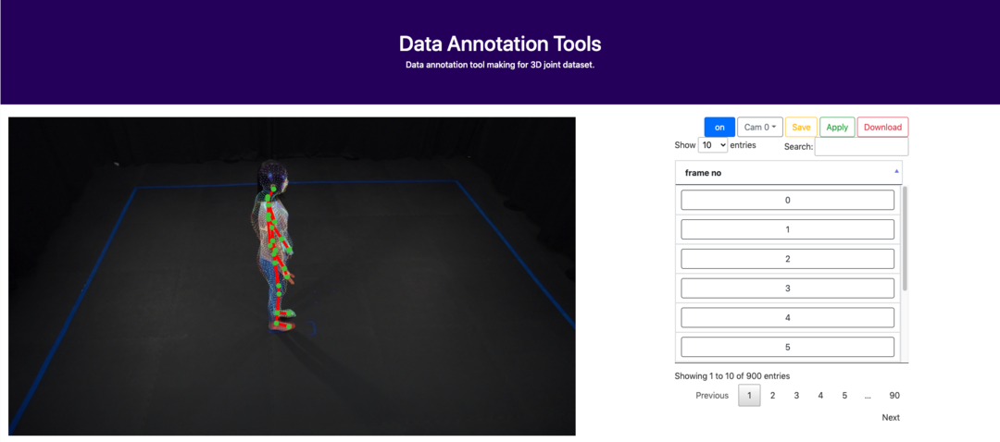

# NIAAnnotationTools

## Introduction
한국 정보화 진흥원 2020 인공지능 데이터셋 어노테이션 툴 입니다

**본 툴에서 제공하는 기능**
 - video 파일 업로드 및 프레임 단위 이미지 분할
 - 2D Human pose estimation을 위한 2D Keypoint dataset 구축
 - 3D Human pose estimation을 위한 3D Keyopint dataset 구축
 - Human shape recovery를 위한 rotation, shape params(SMPL), trans params(SMPL)
 
 ## 설치 및 실행
1. 깃 레포지토리 clone
```
git clone https://github.com/sweetkco/NIA2020AnnotationTools.git
```
2. library 설치
```
pip install -r requirements.txt
```
3. database 초기설정
```
python manage.py makemigrations
```
```
python manage.py migrate
```
4. 실행
```
python manage.py runserver
```
 
 ## 입력 데이터
  - 4개의 동기화된 비디오 데이터 (.mp4)
  - intrinsics matrix (3x3)
  - extrinsics matrix (3x4)
  
 ## 다운로드되는 데이터
 **zip파일 형태로 다운받을 수 있습니다**  
  - 2D_json(*.json)
  - 3D_json(*.json)
  - 3D_shape(*.obj)
  - Camera_json(*.json)
  - Image(.jpg)
 
 ## 구축 데이터셋 종류 및 형태
 
 1. 2D_json (file-naming: {franme_no}.json)
 ```
 info{
  "supercategory" : str,
  "img_width" : int,
  "img_height : int,
  "camera_no" : int,
  "2d_pos  : [2D-keypoint location info],
  "annotations" : [annotations]
 }
 ```
```
annotations {
 "img_no" : int,
 "img_path" : str,
 "2d_pos" : [2D-keypoint location]
}
```

2. 3D_json (file-naming: 3D_{franme_no}.json)
```
 info{
  "supercategory" : str,
  "img_width" : int,
  "img_height : int,
  "camera_no" : int,
  "3d_pos : [3D-keypoint location info],
  "3d_rot" : [3D-keyopint rotation info],
  "annotations" : [annotations]
 }
```
```
annotations{
 "frame_no" : str,
 "obj_path" : str,
 "3d_pos" : [3D-keypoint location],
 "3d_rot" : [3D-keypoint rotation],
 "trans_params" : [trans parameter(SMPL)]
}
```
3. Camera_json (file-naming: {camera_no}.json)
```
{
"camera_no" : int,
"extrinsics" : [extrinsics matrix],
"intrinsics" : [intrinsics matrix]
}
```
4. Shape_json (file-naming: {frame_no}.json)
```
{
 "shape_params" : [shape parameter(SMPL)]
}
```
5. Image (file-naming: {frame_no}/frame_{frame_no}.jpg)

 ## 기타
 - 비디오의 첫 프레임은 원점(0,0,0)에서 T-pose로 시작해야 정확한 데이터를 구할 수 있습니다
 - keypoint data 초기값은 현재 입력된 데이터가 없을경우 이전 프레임값을 가져오고 없을 이전 데이터도 없을 경우 T-pose가 초기값으로 사용됩니다
 - intrinsics matrix, extrinsics matrixs는 모두 cm 단위 입니다
 - intrinsics matrix 의 principal point는 width로 normalize 해야합니다 ( {principal-point / {image-width} )
 - 4개 카메라 관련 정보를 모두 업로드해야 데이터셋 구축이 원활히 진행됩니다
 - 본 데이터의 구축은 smpl human body model을 기반으로 돌아가며
 
 ## 라이센스
 
 본 툴은 연구목적으로 수정, 배포 등이 가능하며 상업적 이용 시 스위트케이로 연락
 smpl model license
 @article{SMPL:2015,
      author = {Loper, Matthew and Mahmood, Naureen and Romero, Javier and Pons-Moll, Gerard and Black, Michael J.},
      title = {{SMPL}: A Skinned Multi-Person Linear Model},
      journal = {ACM Trans. Graphics (Proc. SIGGRAPH Asia)},
      month = oct,
      number = {6},
      pages = {248:1--248:16},
      publisher = {ACM},
      volume = {34},
      year = {2015}
    }
sweetk license
@article{SWEETK:2020,
      author = {Joono L., Youngkwang K., Hyukmin K.},
      title = {{SWEETK}: NIA2020 Annotation tools},
      month = oct,
      publisher = {SWEETK},
      year = {2020}
    }
